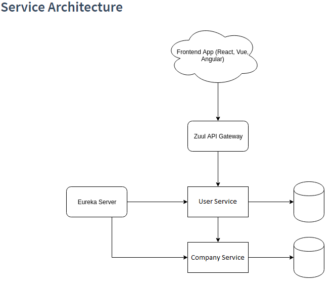

# MiniMicroService
This assignment is about writing a software that is a network of loosely coupled web services.
The different services communicate over REST Apis and are able to cooperate even if they are not on the same computer or are written in different languages.

## Arhitecture

  

## How it works
1. Eureka Server for service discovery
2. Zuul for API Gateway
3. User service
    store User entities in its own database
    properties: id, name
    able to retrieve all users on a REST endpoint (GET)
    able to save a user (POST)

4. Company service
    able to retrieve all users and their companies
    able to retrieve all user's details 
